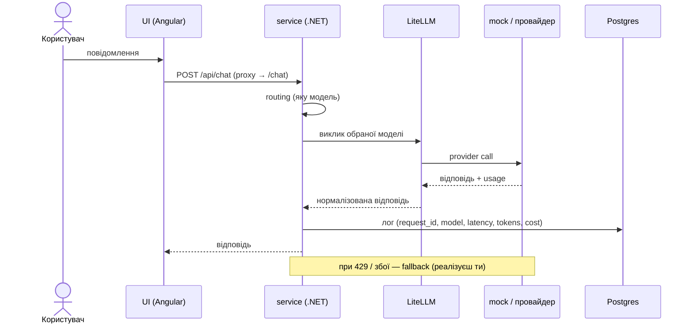

# Getting started — гайд для студента

Це каркас твого capstone — бота підтримки з LLM control plane. Каркас готовий і
запускається однією командою; твоя робота — дописати control plane (routing, fallback,
cost, guardrails, HITL, observability, evals). Нижче — вимоги, запуск і що в кожній папці.

Коротко про поділ праці: **пишеш .NET + конфіг + Python-evals; Angular не чіпаєш — він готовий.**
Уся логіка (control plane) — у `service/`, а LiteLLM просто ходить у провайдерів.

> **Windows:** усі команди курсу виконуй у **Git Bash** (ставиться разом із Git for Windows).
> У PowerShell `curl` — це аліас `Invoke-WebRequest`, а `VAR=x команда` не працює;
> PowerShell-варіанти наведені лише там, де вони справді відрізняються.

> Ще не готував(-ла) машину? Спершу [PREREQUISITES.md](PREREQUISITES.md) —
> перевірка системи, акаунтів і навичок за 15–20 хвилин, до першого уроку.

---

## 1. Вимоги

### Обов'язково (рекомендований шлях — усе в контейнерах)

| Інструмент | Версія | Навіщо |
|---|---|---|
| Docker Desktop **або** Rancher Desktop | Docker Engine 24+, Compose v2 | піднімає весь стек |
| Git | будь-яка сучасна | клонувати репо |

Перевір: `docker version` і `docker compose version` (саме `compose` без дефіса).
Треба ~4 ГБ вільного місця під образи і ~4 ГБ RAM для контейнерів.

**Вільні порти на хості:** `4200` (UI), `8080` (service), `4000` (gateway), `5432` (Postgres).
Mock-провайдер працює лише всередині docker-мережі, хостовий порт йому не потрібен.
Якщо якийсь порт зайнятий — див. [Troubleshooting](#8-troubleshooting).

### Опційно (лише якщо розробляєш компонент поза контейнером)

- **.NET 8 SDK** — щоб білдити / запускати `service` чи `mock-provider` локально без Docker.
- **Node 20 + npm** — щоб запускати `ui` локально (Angular CLI підтягнеться з `devDependencies`).
- **Python 3.12** — щоб ганяти `evals` з хоста (у стеку і CI окремо не потрібен).

### Реальний ключ провайдера

Потрібен **тільки** для model-based evals (оцінка справжньої якості відповіді, окремий тиждень).
Увесь core проходиться на **mock — без ключа, безкоштовно**.

---

## 2. Швидкий старт

```bash
# варіант А: щойно клонував курсовий репо — стартер у підпапці
cd llmops-bootcamp/starter
# варіант Б: це вже ТВІЙ репо, створений зі стартера (§11, крок 0) — ти в корені
docker compose up --build
```

Перший запуск довгий: тягне образи (LiteLLM, Postgres) і білдить .NET + Angular. Далі — швидко.

Що маєш побачити в логах:

- `ui` → `Application bundle generation complete` і `➜  Local:   http://localhost:4200/`
- решта контейнерів у статусі `Up`.

Відкрий у браузері:

```
http://localhost:4200
```

Побачиш чат «Підтримка». Напиши «Як скинути пароль?» — відповідь піде повним шляхом
UI → service → LiteLLM → mock і повернеться в чат.

**Зупинити:**

```bash
docker compose down        # зупинити стек
docker compose down -v     # + стерти дані Postgres (чистий старт)
```

---

## 3. Структура репозиторію

```
.
├─ docker-compose.yml          # весь стек одним файлом
├─ .github/workflows/
│  └─ eval-gate.yml            # CI: піднімає стек, ганяє evals, блокує regression на PR
│
├─ ui/                         # Angular-чат — ДАЄТЬСЯ ГОТОВИМ, не змінюєш
│  ├─ src/app/app.component.ts #   сам чат-компонент (standalone)
│  ├─ src/main.ts              #   bootstrap застосунку
│  ├─ src/index.html, styles.css
│  ├─ proxy.conf.json          #   dev-proxy: /api → service:8080
│  ├─ angular.json, tsconfig*.json, package.json
│  └─ Dockerfile
│
├─ service/                    # .NET сервіс = CONTROL PLANE — ТУТ ТИ ПРАЦЮЄШ
│  ├─ Program.cs               #   /chat + API-контракт; місця для твого коду позначені TODO(student)
│  ├─ Service.csproj, appsettings.json
│  └─ Dockerfile
│
├─ gateway/                    # LiteLLM — провайдер-адаптер (конфіг, не код)
│  ├─ litellm-config.yaml      #   список моделей: mock, gpt-4o-mini, gpt-4o, azure
│  └─ .env.example             #   ключі провайдерів (для mock не потрібні)
│
├─ mock-provider/              # фейковий OpenAI-провайдер — ДАЄТЬСЯ ГОТОВИМ
│  ├─ Program.cs               #   канонічні відповіді + інжекція збоїв
│  ├─ MockProvider.csproj
│  └─ Dockerfile
│
├─ db/
│  └─ schema.sql               # таблиці requests, prompts (створюються при старті Postgres)
│
└─ evals/                      # оцінювання якості — ТУТ ТИ ПРАЦЮЄШ
   ├─ run.py                   #   rule-based eval runner
   ├─ golden.jsonl             #   тест-кейси (вхід + очікування)
   └─ requirements.txt         #   stdlib-only
```

### Що робить кожна частина

- **`ui/` (Angular, готове).** Тонкий чат. Ходить у сервіс через dev-proxy `/api` → `service:8080`
  (див. `proxy.conf.json`). Ти його **не змінюєш** — уся твоя робота на бекенді.
- **`service/` (.NET, твоє).** Це control plane. Ендпоінт `/chat` приймає повідомлення,
  обирає модель, кличе LiteLLM, логує в Postgres. Тут ти реалізуєш routing, fallback, cost,
  guardrails, HITL. Ендпоінти `/observability` `/cost` `/prompts` `/health` `/approvals` —
  це **API-контракт** для готової консолі; ти наповнюєш їх даними.
- **`gateway/` (LiteLLM).** Єдиний вихід до провайдерів. Ти лише додаєш моделі/провайдерів у
  `litellm-config.yaml`. Рішення (яку модель, коли fallback) приймає **сервіс**, не gateway.
- **`mock-provider/` (готове).** OpenAI-сумісний фейк. Дає безкоштовні детерміновані відповіді
  і вміє на замовлення падати — це основа для reliability і evals без реального ключа.
- **`db/schema.sql`.** Базова схема; ти розширюєш під власні логи/cost/prompt records.
- **`evals/` (твоє).** `run.py` б'є по сервісу кейсами з `golden.jsonl` і рахує, скільки пройшло.
  CI використовує це як гейт: якщо пройшло менше за поріг — merge блокується.

---

## 4. Як усе працює разом



---

## 5. Перевірка, що працює

```bash
# статус контейнерів
docker compose ps

# health сервісу
curl http://localhost:8080/health          # -> {"status":"ok"}

# чат напряму (ASCII, щоб не було проблем із кодуванням у терміналі)
curl -X POST http://localhost:8080/chat \
  -H "Content-Type: application/json" \
  -d '{"message":"please check my order"}'

# SQL до лога (лаби постійно просять SELECT-и) — psql уже є всередині контейнера:
docker compose exec postgres psql -U llmops -d llmops
#   далі звичайний SQL; вихід: \q. Креденшели: llmops/llmops, база llmops
#   GUI-клієнт (DBeaver/pgAdmin): host localhost, port 5432, ті самі креденшели
# або одним рядком:
docker compose exec postgres psql -U llmops -d llmops -c "SELECT * FROM requests ORDER BY created_at DESC LIMIT 5;"

# логи
docker compose logs -f service
docker compose logs mock-provider
```

> На Windows у Git Bash кирилиця в аргументах `curl` може псуватися. Для перевірки
> української краще користуйся самим чатом на http://localhost:4200 або шли ASCII.

---

## 6. Evals і eval-гейт

Eval прогоняє кейси з `golden.jsonl` через сервіс і рахує пройдені.

**Рекомендований спосіб — усередині docker-мережі** (так само, як у CI; оминає хостові
порти й корпоративний проксі):

```bash
docker run --rm --network <project>_default \
  -e SERVICE_URL=http://service:8080 -e PYTHONUTF8=1 \
  -v "$(pwd)/evals:/e:ro" python:3.12-slim \
  python /e/run.py --dataset /e/golden.jsonl --threshold 5
```

`<project>` — префікс мережі (звичайно ім'я папки; глянь `docker network ls`).

**Windows/Git Bash:** MSYS інколи «перетворює» шляхи у монтуванні (`/e:ro` → `E:
o`).
Якщо побачив таку помилку — додай префікс `MSYS_NO_PATHCONV=1` перед `docker run …`.

Або з хоста (якщо `8080` вільний і без проксі):

```bash
SERVICE_URL=http://localhost:8080 python evals/run.py --dataset evals/golden.jsonl --threshold 5
```

```powershell
# PowerShell-варіант того самого
$env:SERVICE_URL="http://localhost:8080"; python evals/run.py --dataset evals/golden.jsonl --threshold 5
```

Вихід: `eval: 6/6 passed, threshold 5`, код виходу `0` (green) або `1` (red).

**Як гейт ловить регресію:** сервіс шле system-промпт зі словом «support» → mock віддає
канонічні відповіді → evals зелені. Зламай промпт (прибери «support») → mock почне
відповідати «не знаю» → частина кейсів впаде → пройдено менше за поріг → **гейт червоний**.
Спробуй сам: зміни промпт у `service/Program.cs`, `docker compose up --build -d service`, прожени evals.

---

## 7. Симуляція збоїв (для reliability)

Mock падає на замовлення — двома способами:

- **Маркер у повідомленні** (працює і крізь gateway): напиши в чат/запит `__fail_503`,
  `__fail_429`, `__delay`, `__garbage`.
- **Query до mock напряму** (усередині мережі): `?fail=503`, `?delay=2000`, `?garbage=1`.

На цьому ти будуєш fallback, retry, circuit breaker і graceful degradation.

---

## 8. Troubleshooting

| Симптом | Причина / фікс |
|---|---|
| `port is already allocated` при `up` | Порт зайнятий іншим процесом. Звільни його або перемап у `docker-compose.yml` (напр. `"8090:8080"`), тоді звертайся на новий порт. |
| `curl localhost:8080` дає чужу відповідь / 404 | На хості вже щось слухає цей порт (напр. локальний Apache/pgAdmin). Перемап порт або тестуй усередині мережі. |
| Python/скрипт дає 404 на `localhost`, а curl — ок | Різний резолв `localhost` (IPv4/IPv6) або **корпоративний проксі** ганяє `localhost`. Використай `127.0.0.1`, постав `NO_PROXY=localhost,127.0.0.1`, або ганяй усередині docker-мережі. |
| Перший `/chat` повільний або порожній | Gateway (LiteLLM) холодний на першому виклику. Повтори — далі швидко. |
| Кирилиця в `curl -d` перетворюється на `?` | Git Bash на Windows псує non-ASCII в аргументах. Шли через чат/UI, з файлу (`--data @file.json`) або з Linux-контейнера. |
| `ui` не відкривається | Дочекайся `Application bundle generation complete` в `docker compose logs ui`; перший білд Angular довгий. |
| Треба чистий старт | `docker compose down -v` (стирає дані Postgres), потім `up --build`. |

---

## 9. Що будуєш ти (seam'и)

Шукай `TODO(student)` у `service/Program.cs` — це місця, які дороблюєш:

- **routing** — яку модель обрати під задачу;
- **fallback** — порядок провайдерів при 429/5xx;
- **cost** — облік токенів і вартості, budget-alert;
- **guardrails** — PII / prompt injection;
- **HITL** — approval перед незворотною дією (tool-call);
- **API-контракт** — наповнити `/observability` `/cost` `/prompts` `/approvals` даними для консолі;
- **evals** — свої graders і кейси в `evals/`.

Кожен seam підписаний номером тижня: `TODO(student, W2)` тощо — тож видно, що і коли робити.
Core усього цього проходиться на mock; реальний ключ вмикається лише на тижні оцінки якості.

---

## 10. Перемикання на реальний ключ

За замовчуванням усе на mock (безкоштовно, без ключа). Коли захочеш реальну модель:

1. `cp gateway/.env.example gateway/.env`
2. впиши `OPENAI_API_KEY=...` (і/або Azure-змінні) у `gateway/.env`
3. підніми стек з реальною моделлю:

```bash
MODEL=gpt-4o-mini docker compose up --build
```

Сервіс бере модель зі змінної `MODEL` (див. `service/Program.cs`), LiteLLM підставляє ключ
із `gateway/.env`. Повернутися на mock — звичайний `docker compose up` без `MODEL`.

Що змінюється: на mock відповіді детерміновані (демо + структурні тести), на реальній
моделі — справжня якість, багатоходовий контекст і model-based evals (LLM-as-judge).
Rule-based evals і весь інженерний core однакові в обох режимах.

---

## 11. Здача домашок і перевірка

### Крок 0 (один раз): свій репозиторій зі стартера

Стартер — **підпапка** цього репо, тому звичайний fork не підійде: у твоєму
репозиторії коренем має бути **вміст `starter/`** — інакше CI-шаблон
`.github/workflows/eval-gate.yml` не запуститься (GitHub бачить workflows лише
в корені). Один раз зроби так:

```bash
# 1) створи на GitHub порожній репозиторій, наприклад llmops-bootcamp-my
# 2) скопіюй вміст starter/ (УВАЖНО: разом із прихованою папкою .github!)
git clone https://github.com/TarasFedorenkoFTV/llmops-bootcamp.git
mkdir my-bootcamp && cd my-bootcamp
cp -r ../llmops-bootcamp/starter/. .
git init -b main && git add -A && git commit -m "start: llmops-bootcamp starter"
git remote add origin https://github.com/<ти>/llmops-bootcamp-my.git
git push -u origin main
```

Перевір себе: з кореня твого репо працює `docker compose up --build`, а на
першому ж PR у вкладці Actions запускається `eval-gate`. (`cp -r …/starter/. .`
з крапкою в кінці копіює і приховані файли; на Windows зручно з Git Bash.)

Важливо розуміти навіщо: це **твій** репозиторій, а не «здача в чужу систему».
Усі 6 тижнів ти накидуєш рішення в нього — і після курсу він **залишається
тобі**: зібраний власноруч production-проєкт із CI-гейтом і живою консоллю,
який не соромно показати в портфоліо і розібрати на співбесіді.

### Студент здає

1. Гілка + Pull Request у своєму репозиторії (створеному в кроці 0).
2. На PR запускається CI (`.github/workflows/eval-gate.yml`): піднімає стек, ганяє evals і
   **червоніє, якщо пройдено менше за поріг** (регресія).
3. В описі PR: що реалізовано цього тижня + скрін консолі (які плитки/картки ожили).

### Ментор перевіряє

> Процес, глибина перевірки (коли обов'язково піднімати стек, а коли достатньо
> артефактів PR), критерії повернення, час і формат фідбеку —
> [docs/MENTOR_GUIDE.md](../docs/MENTOR_GUIDE.md). Тижневий чек-лист — нижче.

### Чек-лист прийняття по тижнях

- **W1** — стек піднявся; кожен запит у таблиці `requests`; промпт версіонується.
- **W2** — routing обирає різні моделі; є `cost_usd`; консоль показує Вартість/бюджет.
- **W3** — повторний запит віддається з кешу (`latency_ms` < 50); tool-виклик виконується; timeout та ключ ідемпотентності описані в PR (реалізація — опційна доріжка).
  (Лічильники hit/miss стають видимими в консолі лише на W5 — на W3 їх достатньо мати в коді.)
- **W4** — при падінні провайдера спрацьовує fallback; незворотна дія — через approval (`/approvals`).
- **W5** — консоль показує p95/error-rate і статус провайдерів; golden dataset розширений власними кейсами, поріг оновлений за правилом із hw5.
- **W6** — CI-гейт блокує регресію; демо інциденту (outage → fallback → recovery).

Мінімальна планка кожного тижня: deliverable піднімається `docker compose up` і його видно
в чаті/консолі або в evals. Нічого «в стіл» — усе в працюючій системі.
